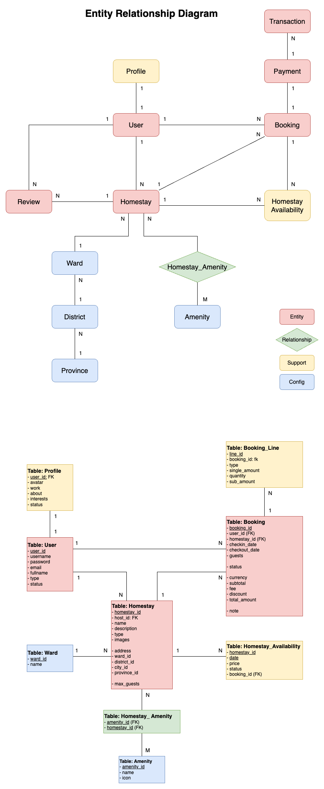
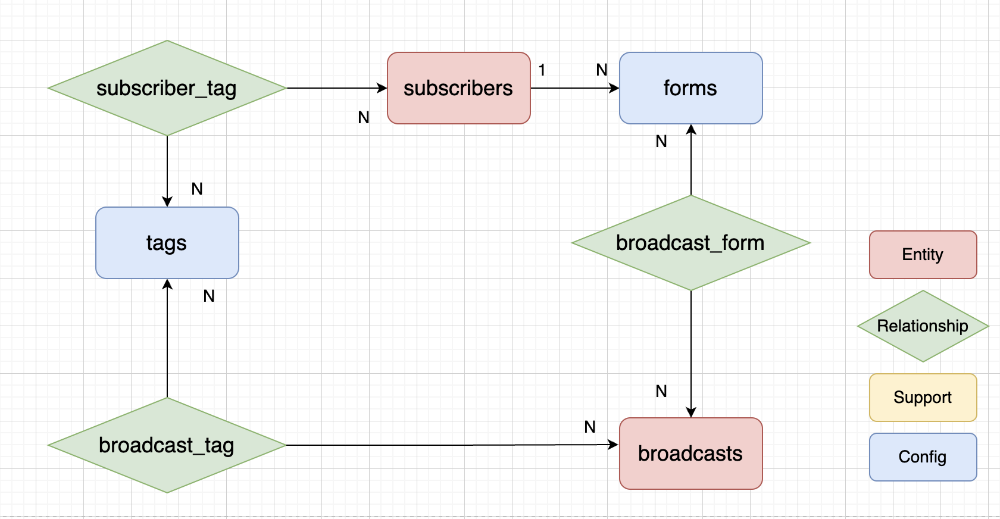

# Email marketing with DDD

## Overview
Clone ConvertKit

**Các tính năng chính:**

1. Quản lý người đăng ký.
2. Gắn **tag** cho họ. **Tag** giúp lọc người đăng ký khi bạn muốn gửi email.
3. Gửi **broadcast email** (hoặc email một lần). Bạn viết nội dung, đặt các bộ lọc và nhấn nút gửi.
4. Tạo **sequences email**. Một chuỗi là một tập hợp các email được gửi đến người đăng ký sau một khoảng thời gian nhất định.
- Ví dụ: bạn viết bốn email và muốn gửi các email này trong bốn tuần. Bạn có thể tạo một chuỗi thực hiện điều đó tự động.
- Và điều tuyệt vời về chuỗi là chúng xử lý cả người đăng ký mới. Vì vậy, nếu bạn tạo chuỗi này vào tháng Hai và một người đăng ký vào tháng Năm, họ vẫn sẽ được thêm vào chuỗi và nhận một email mỗi tuần.
5. Thêm người đăng ký vào các chuỗi dựa trên các tiêu chí cụ thể. Chúng ta cũng có thể tạo các bộ lọc khác nhau.
Ví dụ: chúng ta muốn loại trừ những người đăng ký đã mua một sản phẩm cụ thể hoặc có một thẻ cụ thể.
6. Tạo các biểu mẫu đăng ký nơi mọi người có thể nhập địa chỉ email của họ. Bạn có thể xây dựng một biểu mẫu HTML với trường nhập email có thể được nhúng vào trang web của bạn. Nếu ai đó gửi biểu mẫu này, họ sẽ được thêm vào danh sách email của bạn.
7. Theo dõi việc mở email và nhấp vào liên kết.
8. Tạo báo cáo từ các số liệu này.

### Subscribers

Subscribers đại diện cho một người trong danh sách e-mail. Một subscriber có thể được tạo theo nhiều cách:
- Thử công (Manually)
- Khi submit form
- Import csv
  
### Broadcasts

Broadcasts là các email bạn muốn gửi một lần tới một nhóm người đăng ký (subscribers). Bạn có thể gửi thủ công hoặc lên lịch để gửi.

Điều kiện lọc:
- Người đăng ký có những thẻ nào ?
- Họ đến từ hình thức nào ?
- Họ đã mua sản phẩm gì ?

Các số liệu sau đây có thể theo dõi hiệu suất của **Broadcasts**
- Có bao nhiêu người đã nhận được thư ? (vd: 1000 email)
- Tỷ lệ mở. Có bao nhiêu người mở thư ? (vd: 49% - 490 opened)
- Tỷ lệ nhấp chuột. Có bao nhiêu người đã nhấp vào liên kết bên trong nội dung (nếu có) ? (vd: 8% click rate - 80 clicked)

### Sequences

Sequences là một tập hợp các email được nhóm lại với nhau. Lấy ứng dụng email DDD này làm ví dụ, bạn có thể tạo một chuỗi như thế này:
- Sequence name: Domain-Driven Design Course
    - 1st e-mail: What Is DDD?
    - 2nd e-mail: Using DTOs
    - 3rd e-mail: The Benefits of Value Objects

Nếu bạn muốn gửi một emial mỗi thứ 4 hàng tuần. Bạn có thể chỉ định như sau:
- 1st e-mail sẽ được gửi vào thứ 4 tuần đầu tiền sau khi bạn publish sequence.
- 2nd e-mail sẽ được gửi vào thứ 4 tuần thứ 2.
- 3rd e-mail sẽ được gửi vào thứ 4 tuần thứ 3.

### Automations

Automation là một "flow" của events và action:"When an event happens, then do this action."

VD: When a person subscribes to my e-mail list, add them to my awesome e-mail sequence.

Tính năng tự động hoá có thể giúp mọi người mới đăng ký có thể nhận được những email quan trọng và có giá trị.
Có 2 phần thiết yếu của Automation:
- Event: Một sự kiện sẽ xảy ra và nó kích hoạt một hành động.
- Action: Đây là những gì ứng dụng sẽ thực hiện như là hệ quả của sự kiện.

Demo app:
- Event: when a subscriber subscribes to a form.
- Action: then add them to a sequence.
- Action: tag them

## User Stories

| User Story                          | Description                                                                           |
|-------------------------------------|---------------------------------------------------------------------------------------|
| **Subscribers**                     |                                                                                       |
| Creating a subscriber               | Cần một API endpoint.                                                                 |
| Importing subscribers from CSV      | Chúng tôi xem đây là một "admin task" nên nó sẽ là một Console Command.               |
| Filtering subscribers               | Đây không thực sự là một user story nhưng chúng tôi cần nó ở nhiều nơi.               |
| **Broadcasts**                      |                                                                                       |
| Creating a broadcast                | Với bộ lọc và nội dung.                                                               |
| Sending a broadcast                 | Đầu tiên nó lọc ra những người đăng ký, sau đó xếp hàng các e-mail.                  |
| **Sequences**                       |                                                                                       |
| Creating a sequence                 | Với dữ liệu cơ bản như tiêu đề.                                                       |
| Adding a sequence mail              | Với bộ lọc và lịch trình (chẳng hạn như 3 ngày sau e-mail cuối cùng).                 |
| Publishing a sequence               | Chỉ là một trạng thái chuyển từ nháp sang đã xuất bản.                               |
| Proceeding a sequence               | Điều này sẽ xử lý toàn bộ logic lên lịch. Nó cần được lên lịch để chạy thường xuyên. Nó sẽ gửi các e-mail. |
| **Tracking**                        |                                                                                       |
| Tracking e-mail opens               | Có thể là một broadcast hoặc một e-mail sequence. Cần một API endpoint.              |
| Tracking link clicks                | Có thể là một broadcast hoặc một e-mail sequence. Cần một API endpoint.              |
| **Automations**                     |                                                                                       |
| Creating automations                | Mỗi automation có một sự kiện và bất kỳ số lượng hành động nào.                      |
| Running automations                 | Khi sự kiện được chỉ định xảy ra, chúng tôi cần thực hiện các hành động.             |
| **Reports**                         |                                                                                       |
| Sequence progress                   | Chẳng hạn như có bao nhiêu người đăng ký đã hoàn thành nó.                           |
| New subscribers                     | Có bao nhiêu người đăng ký mới trong tuần này, tháng này, hôm nay, hoặc tổng cộng.  |
| Daily new subscribers               | Có bao nhiêu người đăng ký mới hàng ngày.                                            |
| Performance for a sent mail         | Cho một broadcast hoặc một e-mail sequence (tỷ lệ mở, tỷ lệ nhấp).                   |
| Performance for a whole sequence    | Tổng hợp các e-mail riêng lẻ cho cả sequence.                                        |

## Data Modeling

### Overview

- Entity là một đối tượng có định danh (**ID**) và vòng đời (**status**)
- ID và status quan trọng
    - Trả lời: "Tập dữ liệu/đối tượng này có phải Entity không?"
    - Phục vụ quá trình phát triển phần mền.
  
 **Các loại bảng phân loại theo chức năng** 
 - Entity table
 - Relationship table
 - Supportive table (hỗ trợ cho entity)
 - Configuration table (ví dụ: danh sách các tỉnh quận huyện, cấu hình, ...)

**Ví dụ về hệ thống booking**



### Thực hành



Với trường hợp của Broadcasts sẽ có một số vấn đề:
- Chúng ta cần thêm hai bảng và có thể cần tới sáu mối quan hệ phức tạp (eloquent relationships) để triển khai tính năng lọc theo thẻ (tag) và biểu mẫu (form).
- Các bộ lọc gần như luôn là thứ thay đổi theo thời gian.
  - Landing page (trang đích, tương tự như biểu mẫu)
  - Segment (Phân khúc). Đây là một tập hợp con của người đăng ký dựa trên một số tiêu chí nhất định.
  - Sản phẩm và mua hàng. Họ cũng có các tính năng thương mại điện tử.
  - Tích hợp với các dịch vụ khác.
- Nếu chúng ta chọn cấu trúc này, chúng ta sẽ cần các bảng và mối quan hệ mới cho mọi trường hợp sử dụng mới.
- Vì vậy, giải pháp này có thể hoạt động, nhưng tôi không cảm thấy nó đủ linh hoạt để xử lý các tình huống thực tế.

**Giải pháp**
- **Using a JSON column** trong broadcasts table sẽ thêm JSON column, giống như sau:
```json
{
  "form_ids": [1,2,3],
  "tag_ids": [12,4]
}
```
**Drawbacks**

Không có tính toàn vẹn dữ liệu. Chuyện gì xảy ra nếu bạn xóa thẻ có ID là 4? Bạn cần thêm đoạn mã để đảm bảo không còn bộ lọc nào tham chiếu đến nó nữa. 
Tuy nhiên, trong tình huống này, điều đó chỉ đúng một phần. Sử dụng các bảng trung gian broadcast_form và broadcast_tag sẽ mang lại tính toàn vẹn dữ liệu. Nhưng chúng ta biết rằng sau này cũng cần các bộ lọc tương tự cho chuỗi [thư điện tử]. Điều đó có nghĩa là chúng ta buộc phải sử dụng các mối quan hệ đa hình (polymorph relationships), và thay vì broadcast_id, chúng ta phải sử dụng một cái gì đó trừu tượng hơn như sendable_id, cái có thể tham chiếu đến cả bản ghi phát sóng (broadcast) hoặc thư chuỗi (sequence_mail). Vì bạn không thể sử dụng khóa ngoại với các mối quan hệ đa hình, nên việc sử dụng các bảng trung gian không mang lại tính toàn vẹn dữ liệu.

**SentMails**

Điều gì sẽ xảy ra sau khi broadcast đã được gửi? Hệ thống cần tính toán để báo cáo:
- Tổng số email đã gửi
- Tỷ lệ mở email (open rate)
- Click rate (tỷ lệ click vào link trong email - nếu có)

## Domains

